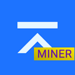

#  Scala GUI Miner

The Scala GUI miner is a beautiful, easy to use, interface for mining Scala.
It is aimed at getting people that have never mined Scala into the crypto
game by making it really simple to get started.


We currently support one very popular miner backend:

1. [xlarig](https://github.com/scala-network/xlarig)

If you'd like to fork this miner for you own coin, please see the __forking__
section later.

## Compiling

### Linux

The miner GUI is built using [Electron](https://electronjs.org) and
[Go](https://golang.org) using the
[Astilectron app framework](https://github.com/asticode/astilectron).

* Install Go

[https://golang.org/dl/](https://golang.org/dl/)

* Install the required Go packages

```shell
go get -u github.com/asticode/go-astilectron@latest
go get -u github.com/asticode/go-astilectron-bundler/...
go install github.com/asticode/go-astilectron-bundler/astilectron-bundler
go get -u github.com/asticode/go-astichartjs@latest
go get -u github.com/asticode/go-astilectron-bootstrap@latest
go get -u github.com/google/uuid@latest
go get -u github.com/mitchellh/go-ps@latest
```

* Clone and build the app

```shell
git clone https://github.com/scala-network/gui-miner gui-miner
cd gui-miner
make
```

NOTE: Ensure you clone the GUI miner into your working $GOPATH

If all goes well the binaries for Windows, macOS and Linux will be available in the `bin` folder.

## Forking

In the spirit of open source we'll be making it really simple to fork and
brand the miner for your own coin. Some structural changes need to be made to
simplify the process. Subscribe to issue [#3][i3] to follow the progress on this
guide.

[i3]: https://github.com/scala-network/gui-miner/issues/3
